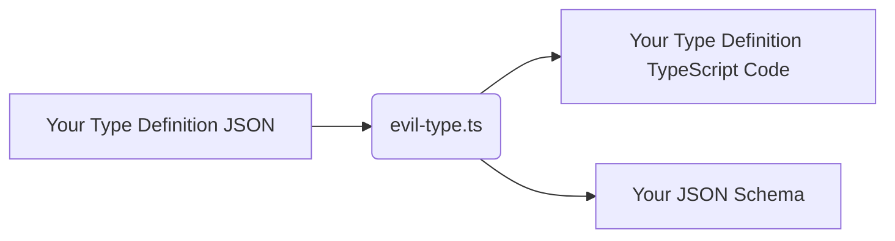

# evil-type.ts

Generates type definitions and validators for TypeScript from proprietary type definition JSON file.

Available in both Web browsers and Node.js.

JSON Schema can also be generated.

The types generated by `evil-type.ts` are intended for "types that humans might manually input as JSON" or "types used in APIs" and strict validators are generated accordingly. Therefore, for most types commonly used within TypeScript code, it is recommended to define types and write type-checking functions directly in TypeScript rather than using `evil-type.ts`.

It also partially supports validations that are difficult to achieve with TypeScript types, such as numeric ranges and string patterns, which are supported by JSON Schema. ( NOTE: Support for JSON Schema Built-in formats in the generated TypeScript code is quite limited. )

## Overview



## What makes you happy?

JSON Schema allows you to easily create data (JSON) of the type you define on an editor such as VS Code with powerful input support and without errors.

The same powerful type checking that JSON Schema provides is available as a Type Guard function (validator function) on your TypeScript code.

You can also use tests such as whether you want to handle numbers in the range 0.0 to 1.0 or URL strings in both JSON Schema and TypeScript.

In addition, the Type Guard function in TypeScript not only simply indicates whether the type matches or does not match, but also provides detailed error information about where and how the type does not match. (To handle this error information, options.validatorOption: "full" specification and shared runtime code ( [./common/evil-type.ts](./common/evil-type.ts) ) are required.)

By using this validator function for JSON sent and received by the API, even if the specifications of the other side are changed silently, it will be easier to understand what has changed in a concise and detailed manner. It also becomes possible to easily return detailed error information to the other party.

## How to install for your project by npm

```sh
npm install @wraith13/evil-type.ts --save-dev
```

## Type Define JSON

- [template: simple validator](./template/simple.json)
- [template: full validator](./template/full.json)
- [example: Jsonable](./resource/jsonable.json)
- [example: Type](./resource/type.json)
- [example: flounder.style.js](https://github.com/wraith13/flounder.style.js/blob/master/type.json)

## How to use

## Development environment construction

0. Install [Visual Studio Code](https://code.visualstudio.com/) ( Not required, but recommended. )
1. Install [Node.js](https://nodejs.org/)
2. Execute `npm install`.

## How to build

requires: [Node.js](https://nodejs.org/), [TypeScript Compiler](https://www.npmjs.com/package/typescript)

`tsc -P .` or `tsc -P . -w`

## Error information example

```json
{
  "path": "./resource/type.json",
  "matchRate": {
    "./resource/type.json#comment": true,
    "./resource/type.json#$ref": true,
    "./resource/type.json#imports": true,
    "./resource/type.json#defines.Type.$type": true,
    "./resource/type.json#defines.Type.export": true,
    "./resource/type.json#defines.Type.members.schema": true,
    "./resource/type.json#defines.Type.members.CommentProperty.$type": true,
    "./resource/type.json#defines.Type.members.CommentProperty.export": true,
    "./resource/type.json#defines.Type.members.CommentProperty.members.comment?.$type": true,
    "./resource/type.json#defines.Type.members.CommentProperty.members.comment?.items.$type": true,
    "./resource/type.json#defines.Type.members.CommentProperty.members.comment?.items.type": false,
    "./resource/type.json#defines.Type.members.CommentProperty.members.comment?.items": 0.5,
    "./resource/type.json#defines.Type.members.CommentProperty.members.comment?": 0.75,
    "./resource/type.json#defines.Type.members.CommentProperty.members": 0.75,
    "./resource/type.json#defines.Type.members.CommentProperty": 0.9166666666666666,
    "./resource/type.json#defines.Type.members.OutputOptions": true,
    "./resource/type.json#defines.Type.members.SchemaOptions": true,
    "./resource/type.json#defines.Type.members.indentStyleTypeMember": true,
    "./resource/type.json#defines.Type.members.IndentStyleType": true,
    "./resource/type.json#defines.Type.members.ValidatorOptionType": true,
    "./resource/type.json#defines.Type.members.AlphaElement": true,
    "./resource/type.json#defines.Type.members.AlphaDefinition": true,
    "./resource/type.json#defines.Type.members.ImportDefinition": true,
    "./resource/type.json#defines.Type.members.Definition": true,
    "./resource/type.json#defines.Type.members.CodeDefinition": true,
    "./resource/type.json#defines.Type.members.NamespaceDefinition": true,
    "./resource/type.json#defines.Type.members.ValueDefinition": true,
    "./resource/type.json#defines.Type.members.InterfaceDefinition": true,
    "./resource/type.json#defines.Type.members.DictionaryDefinition": true,
    "./resource/type.json#defines.Type.members.ArrayElement": true,
    "./resource/type.json#defines.Type.members.OrElement": true,
    "./resource/type.json#defines.Type.members.AndElement": true,
    "./resource/type.json#defines.Type.members.LiteralElement": true,
    "./resource/type.json#defines.Type.members.ReferElement": true,
    "./resource/type.json#defines.Type.members.PrimitiveTypeEnum": true,
    "./resource/type.json#defines.Type.members.PrimitiveTypeElement": true,
    "./resource/type.json#defines.Type.members.Type": true,
    "./resource/type.json#defines.Type.members.EnumTypeElement": true,
    "./resource/type.json#defines.Type.members.TypeofElement": true,
    "./resource/type.json#defines.Type.members.ItemofElement": true,
    "./resource/type.json#defines.Type.members.TypeOrRefer": true,
    "./resource/type.json#defines.Type.members.TypeOrValue": true,
    "./resource/type.json#defines.Type.members.TypeOrValueOfRefer": true,
    "./resource/type.json#defines.Type.members": 0.9972222222222221,
    "./resource/type.json#defines.Type": 0.9990740740740741,
    "./resource/type.json#defines": 0.9990740740740741,
    "./resource/type.json#options.outputFile": true,
    "./resource/type.json#options.indentUnit": false,
    "./resource/type.json#options.indentStyle": true,
    "./resource/type.json#options.validatorOption": true,
    "./resource/type.json#options": 0.75,
    "./resource/type.json": 0.9498148148148149
  },
  "errors": [
    {
      "type": "fragment",
      "path": "./resource/type.json#defines.Type.members.CommentProperty.members.comment?.items.type",
      "requiredType": "\"null\" | \"boolean\" | \"number\" | \"string\"",
      "actualValue": "\"stringx\""
    },
    {
      "type": "solid",
      "path": "./resource/type.json#options.indentUnit",
      "requiredType": "number | \"\\t\"",
      "actualValue": "\"text\""
    }
  ]
}
```

### No error result

```json
{
  "path": "./resource/type.json",
  "matchRate": { "./resource/type.json": true },
  "errors": []
}
```

## Related references

- JSON Schema: https://json-schema.org/
- JSON Schema with VS Code: https://code.visualstudio.com/docs/languages/json#_json-schemas-and-settings

## License

[Boost Software License](./LICENSE_1_0.txt)
